# KEEL North Star

This document defines where KEEL is heading — not where it is today.

## Vision

KEEL is a spec-to-commit automation engine. You feed it a feature
specification. It produces tested, spec-conformant, safe code — ready to
commit. The human approves in batches, not at every step.

```mermaid
graph LR
    subgraph today [Today]
        T1[Human kicks off<br/>each pipeline stage]
        T2[Reviews every output]
        T3[Commits manually]
        T4["Human: 60% · Agent: 40%"]
    end

    subgraph endstate [End State]
        E1[Human feeds<br/>feature spec]
        E2[KEEL runs pipeline]
        E3[Self-corrects]
        E4[Garbage collects]
        E5[Opens PR]
        E6["Human: batch review · Agent: 95%"]
    end

    today -->|evolve| endstate

    style T1 fill:#F57F17,stroke:#E65100,color:#000
    style T2 fill:#F57F17,stroke:#E65100,color:#000
    style T3 fill:#F57F17,stroke:#E65100,color:#000
    style T4 fill:#D32F2F,stroke:#B71C1C,color:#fff
    style E1 fill:#1976D2,stroke:#0D47A1,color:#fff
    style E2 fill:#00796B,stroke:#004D40,color:#fff
    style E3 fill:#00796B,stroke:#004D40,color:#fff
    style E4 fill:#00796B,stroke:#004D40,color:#fff
    style E5 fill:#00796B,stroke:#004D40,color:#fff
    style E6 fill:#388E3C,stroke:#1B5E20,color:#fff
```

## The Principle

**Accuracy over speed.** The pipeline can run as many agents and gates as
needed. We never optimize for fewer steps or faster completion. A feature
that takes 30 minutes and lands clean beats one that takes 5 minutes and
needs 3 follow-up fixes.

## What KEEL Becomes

A feature goes in. KEEL:

1. Classifies intent and complexity (pre-check)
2. Researches unknowns if needed (researcher)
3. Consults on architecture if complex (arch-advisor)
4. Designs interfaces (designer)
5. Writes tests from the spec (test-writer)
6. Writes code to pass the tests (implementer)
7. Verifies code matches spec (spec-reviewer) — self-corrects on failure
8. Verifies domain invariants (safety-auditor) — self-corrects on failure
9. Verifies architecture soundness (arch-advisor verify) — for complex features
10. Verifies everything landed (landing-verifier)
11. Garbage collects docs (doc-gardener)
12. Opens a PR

The human reviews the PR. Not the pipeline. Not each agent's output.

## What KEEL Does NOT Become

- **CI/CD** — KEEL's boundary is the git commit (or PR). What happens
  after push is not KEEL's problem.
- **Deployment/operations** — no infrastructure, no monitoring, no incidents
- **A product** — not a SaaS, not a CLI tool, not an npm package. KEEL is
  a process framework that installs into your repo.
- **A multi-repo orchestrator** — one repo, one KEEL instance
- **A team collaboration tool** — single orchestrator (human or automated),
  not designed for merge conflicts between parallel orchestrators

## Autonomy Ceiling

The end state is: human feeds a feature spec, KEEL produces a PR.

| What KEEL does autonomously | What the human does |
|-|-|
| Pick pipeline variant based on intent | Write the feature spec |
| Route to optional agents | Define domain invariants |
| Self-correct on spec deviation (max 2) | Review PRs in batch |
| Self-correct on safety violation (max 3) | Resolve escalations |
| Self-correct on architecture issues (max 1) | Update north star / specs |
| Garbage collect docs after landing | Approve PR merge |
| Open PR with commit message | |

What KEEL does NOT do autonomously:
- Pick the next feature from the backlog (human decides priority)
- Modify specs or invariants (human decides what to build)
- Push to main or merge PRs (human approves)

## How KEEL Evolves

**Maintainer model:** Single maintainer. Community feedback welcome,
but direction is centralized.

**Release model:** TBD. Currently rolling main branch. May move to
tagged releases as the framework stabilizes.

**Testbed:** The framework needs a real-world project to exercise the
full pipeline end-to-end. Repo Man served this role during initial
development but its scope is small. A larger testbed project — one that
exercises architecture-tier Arch-advisor consultations, multi-layer features,
and the full gate sequence — would strengthen confidence in the pipeline.
This is an open question.

## Growth Stages

| Stage | What changes | Status |
|-|-|-|
| **1. Process framework** | Agents, pipeline, docs, handoff format | Done |
| **2. Self-correcting pipeline** | Structured rejection, wisdom accumulation, intent classification, Arch-advisor | Done |
| **3. Install-anywhere** | install.sh, uninstall.sh, artifact inventory | Done |
| **4. Full autonomy** | Feature → PR without human at each step, automatic GC | Next |
| **5. Testbed project** | Real-world project that exercises the full pipeline | Open |

## Principles for Framework Development

1. **Port, don't reinvent.** If a pattern is battle-tested elsewhere
   (OMA, OpenAI), port it with minimal modification.
2. **Validate with roundtable.** Major changes get 3-model review
   before landing.
3. **Docs drive code** — applies to KEEL itself. Process docs are
   updated in the same commit as the agents they describe.
4. **The repo is the product.** KEEL has no runtime, no server, no
   binary. The markdown files and agent definitions ARE the framework.
