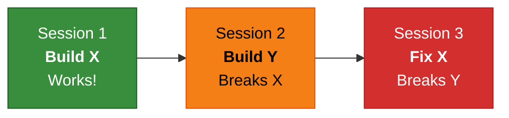
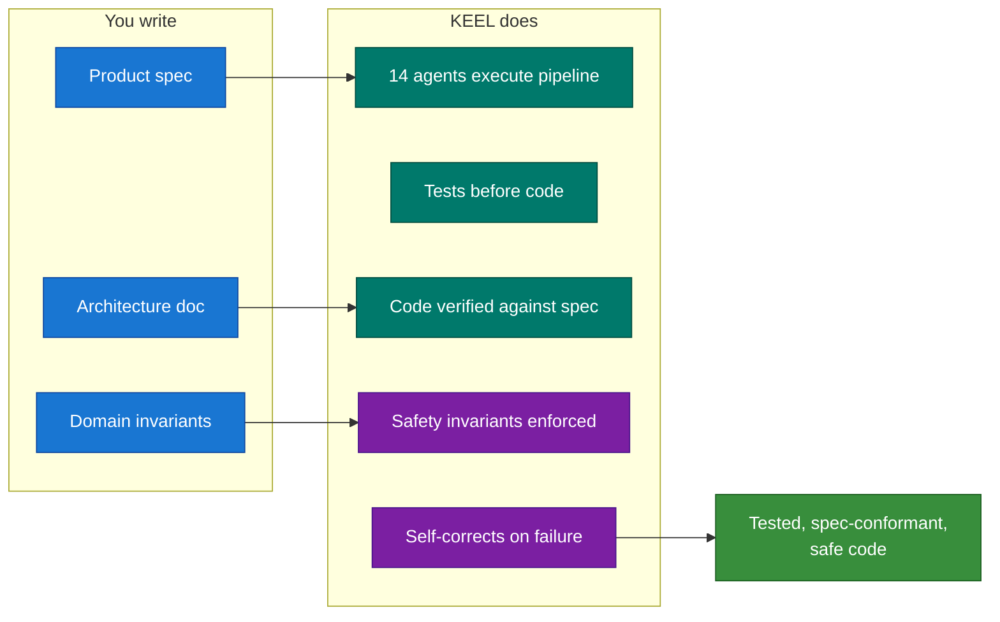

# KEEL

**Knowledge-Encoded Engineering Lifecycle** — a process framework for AI-assisted development. Spec in, stable tested code out.

## The Problem

AI agents forget between sessions. Feature 2 breaks Feature 1. A rules file works until ~10 features — then you need structure.



> Knowledge evaporates. Each feature is a fresh start.

## The Solution

KEEL encodes everything into the repo and runs a self-correcting pipeline.



Gates self-correct: deviation → fix → retry (bounded). Escalates to you instead of thrashing. Knowledge flows forward through handoff files — Feature 20 benefits from Features 1–19.

**[How it works in detail →](docs/HOW-IT-WORKS.md)**

## Who This Is For

- **Solo devs or small teams (1-3)** with an AI agent as primary implementer
- **Projects that grow** — today's 3 features become next month's 30
- **Any AI agent platform** — process is agent-agnostic; reference implementation uses Claude Code

Not for: one-off scripts, throwaway prototypes, <5 feature projects.

## Install

```bash
cd my-project    # new or existing
git clone --depth 1 https://github.com/anthropics/keel.git /tmp/keel
/tmp/keel/scripts/install.sh
rm -rf /tmp/keel
```

Installs 14 agents, 3 skills, 2 hooks, and doc structure into your project. Never overwrites existing files.

```
 After install:
 1. CLAUDE.md            ← fill in <!-- CUSTOMIZE --> sections
 2. docs/north-star.md   ← your project vision
 3. safety-auditor.md    ← your domain invariants
 4. Write a spec         ← docs/product-specs/
 5. /keel-pipeline       ← run it
```

**Existing codebase?** Run `/keel-adopt` after install.
**Full manifest:** [INSTALL.md](docs/INSTALL.md) | **Remove:** [UNINSTALL.md](docs/UNINSTALL.md)

## Case Study

[`examples/repo-man/`](examples/repo-man/) — 31 features, ~3000 LOC Elixir, 250+ tests, all spec-driven. [Lessons learned →](examples/repo-man/CASE-STUDY.md)

## Docs

| Doc | What you'll learn |
|-|-|
| **[NORTH-STAR.md](NORTH-STAR.md)** | Vision, autonomy ceiling, growth stages |
| **[HOW-IT-WORKS.md](docs/HOW-IT-WORKS.md)** | Pipeline, agents, gates, wisdom accumulation |
| [INSTALL.md](docs/INSTALL.md) | Full artifact inventory |
| [UNINSTALL.md](docs/UNINSTALL.md) | Clean removal |
| [QUICK-START.md](docs/process/QUICK-START.md) | First afternoon walkthrough |
| [BROWNFIELD.md](docs/process/BROWNFIELD.md) | Existing codebase adoption |
| [THE-KEEL-PROCESS.md](docs/process/THE-KEEL-PROCESS.md) | Comprehensive process guide |
| [FAILURE-PLAYBOOK.md](docs/process/FAILURE-PLAYBOOK.md) | When the pipeline stalls |
| [GLOSSARY.md](docs/process/GLOSSARY.md) | Terminology |
| [ANTI-PATTERNS.md](docs/process/ANTI-PATTERNS.md) | What not to do |

## License

This framework is provided as-is for use in AI-assisted software development.
