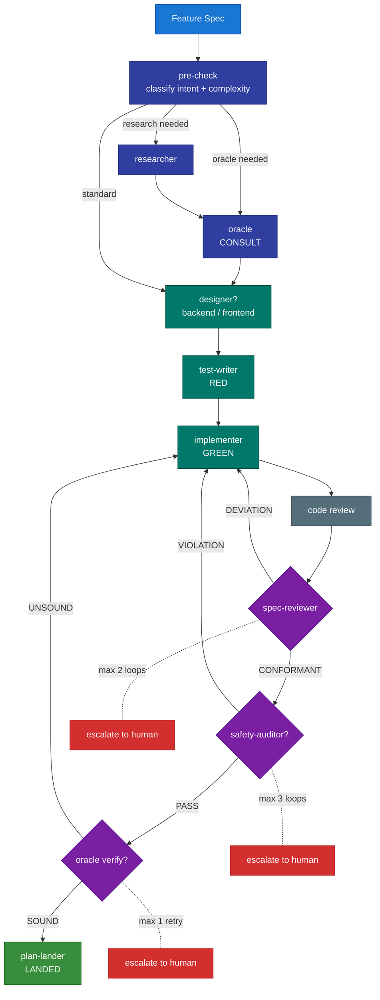
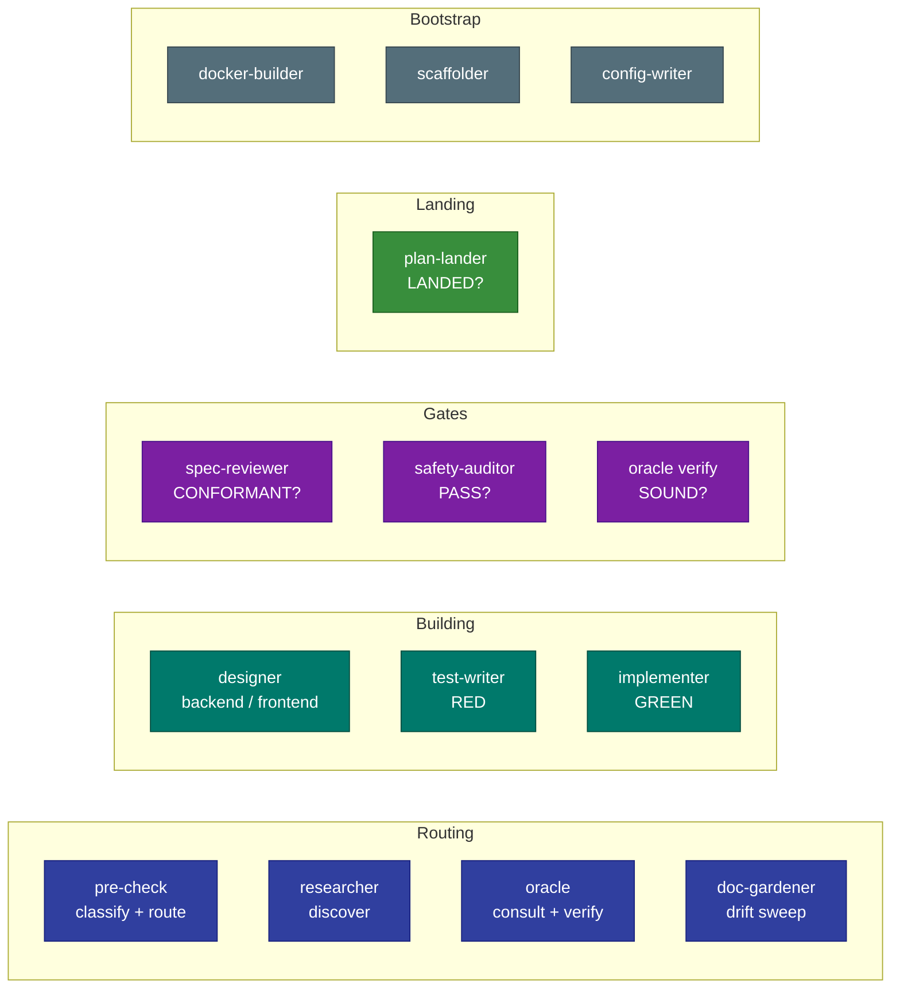
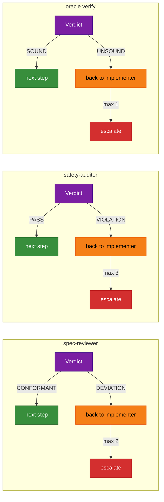
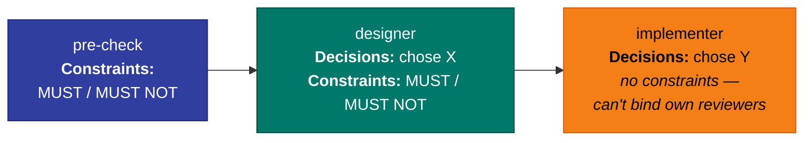
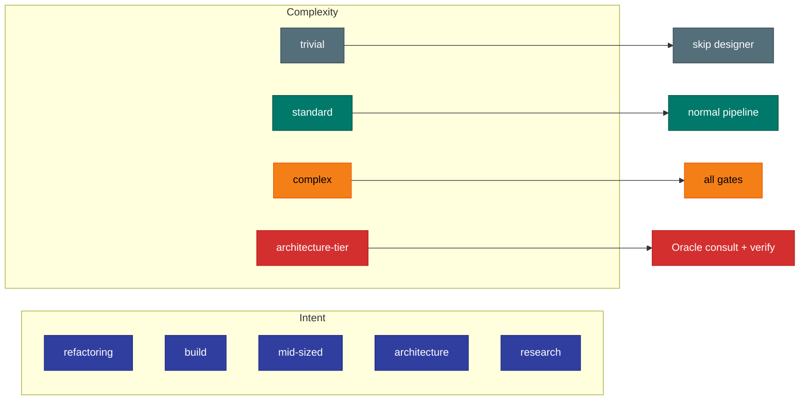

# How KEEL Works

KEEL encodes everything into the repo — specs, invariants, architecture,
testing strategy — and runs a self-correcting pipeline that gates quality
at every step.

## The Pipeline

**The pipeline self-corrects.** Spec-reviewer finds a deviation → routes
back to implementer with findings. Safety-auditor finds a violation →
implementer fixes. After bounded retries, it escalates to you instead of
thrashing.

**Knowledge compounds.** Each agent reads upstream Decisions and Constraints
before starting. Feature 20 benefits from everything learned building
features 1–19.

## The 14 Agents

| Tier | Agents | Why |
|-|-|-|
| **High reasoning** | oracle, implementer, spec-reviewer, safety-auditor, designers, researcher | Design decisions, gate verdicts, deep analysis |
| **Standard reasoning** | pre-check, test-writer, plan-lander, doc-gardener, scaffolder, config-writer, docker-builder | Classification, pattern-following, verification |

See [THE-KEEL-PROCESS.md](process/THE-KEEL-PROCESS.md) for the full agent
roster with inputs, outputs, and tool access.

## Self-Correcting Gates

MINOR-only deviations → CONFORMANT with notes (don't burn loops).

Gate agents output structured `**Verdict:**` fields. The orchestrator copies
verdicts to YAML frontmatter in the handoff file for reliable routing —
no parsing agent prose.

See [FAILURE-PLAYBOOK.md](process/FAILURE-PLAYBOOK.md) for the full decision
tree when gates fail.

## Wisdom Accumulation

Decision-heavy agents (pre-check, designers, oracle) produce both Decisions
and Constraints. The implementer produces Decisions only — it cannot
constrain its own reviewers (spec-reviewer, safety-auditor).

## Intent Classification

Pre-check classifies every feature before routing:

This prevents over-engineering trivial changes and ensures complex changes
get the scrutiny they need.

## AI-Slop Prevention

Pre-check flags these anti-patterns for downstream agents:

- **Scope inflation** — building features not in the spec
- **Premature abstraction** — utilities for one-time operations
- **Over-validation** — error handling for impossible states
- **Documentation bloat** — docstrings on code you didn't write
- **Gold-plating** — feature flags and backwards compatibility when not required

## Platform Mapping

The reference implementation uses Claude Code. The process is agent-agnostic.

| Tier | Claude Code | Other platforms |
|-|-|-|
| **High reasoning** | opus | Your platform's highest-tier model |
| **Standard reasoning** | sonnet | Your platform's standard-tier model |
