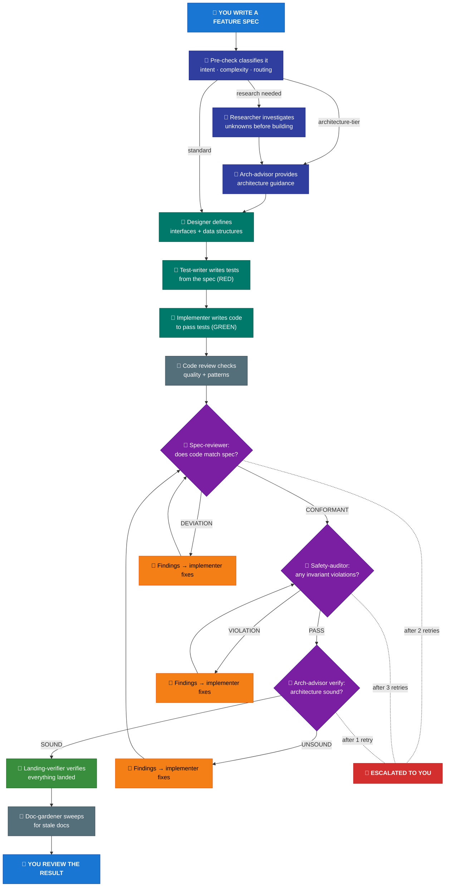
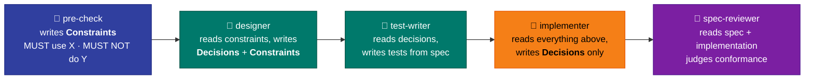
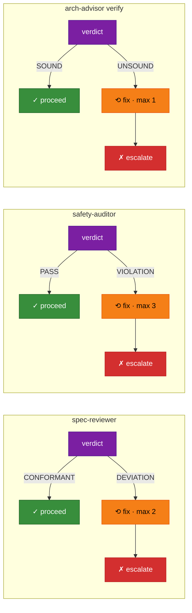
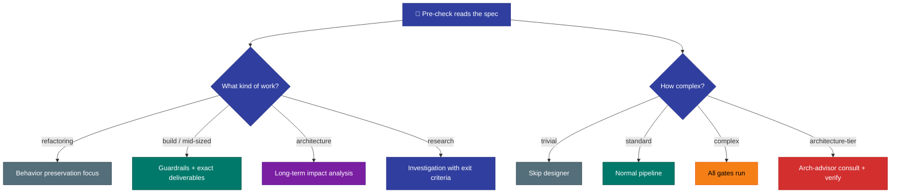
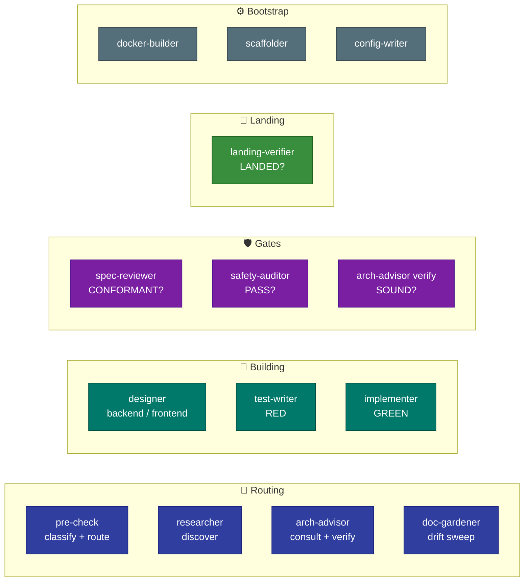

# How KEEL Works

KEEL encodes everything into the repo — specs, invariants, architecture,
testing strategy — and runs a self-correcting pipeline that gates quality
at every step.

## The Pipeline

A feature flows through the pipeline like this:

> 🧑 = you &nbsp;&nbsp; 🤖 = agents &nbsp;&nbsp; You write the spec and review the result. Everything in between is autonomous.

The pipeline **self-corrects**: when a gate finds a problem, it sends
specific findings back to the implementer. After bounded retries, it
escalates to you instead of thrashing.

## How Agents Pass Context

Each agent reads a shared **handoff file** — an append-only document that
accumulates context as the feature flows through the pipeline.

The implementer writes **Decisions only** — it cannot write Constraints
because its downstream agents (spec-reviewer, safety-auditor) are its
reviewers. Letting the implementee constrain its reviewers would undermine
the gates.

## How Gates Decide

Each gate agent outputs a **verdict**. The pipeline branches on it.

MINOR-only deviations get `CONFORMANT` with notes — they don't burn loops.

See [FAILURE-PLAYBOOK.md](process/FAILURE-PLAYBOOK.md) for the full decision
tree when gates fail.

## How Pre-check Routes the Pipeline

Before anything runs, pre-check classifies the feature:

This prevents over-engineering trivial changes and ensures complex changes
get the scrutiny they need.

## The 14 Agents

| Tier | Agents | Why |
|-|-|-|
| **High reasoning** | arch-advisor, implementer, spec-reviewer, safety-auditor, designers, researcher | Design decisions, gate verdicts, deep analysis |
| **Standard reasoning** | pre-check, test-writer, landing-verifier, doc-gardener, scaffolder, config-writer, docker-builder | Classification, pattern-following, verification |

See [THE-KEEL-PROCESS.md](process/THE-KEEL-PROCESS.md) for the full agent
roster with inputs, outputs, and tool access.

## AI-Slop Prevention

Pre-check flags these anti-patterns for downstream agents:

- **Scope inflation** — building features not in the spec
- **Premature abstraction** — utilities for one-time operations
- **Over-validation** — error handling for impossible states
- **Documentation bloat** — docstrings on code you didn't write
- **Gold-plating** — feature flags and backwards compatibility when not required

## Platform Mapping

The reference implementation uses Claude Code. The process is agent-agnostic.

| Tier | Claude Code | Other platforms |
|-|-|-|
| **High reasoning** | opus | Your platform's highest-tier model |
| **Standard reasoning** | sonnet | Your platform's standard-tier model |
